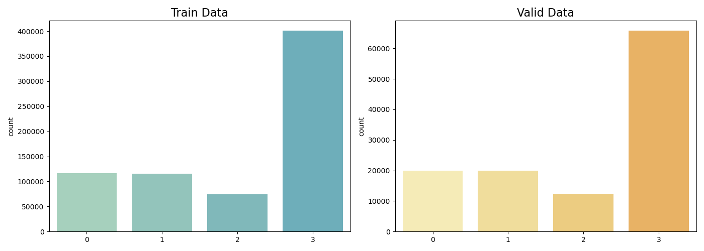
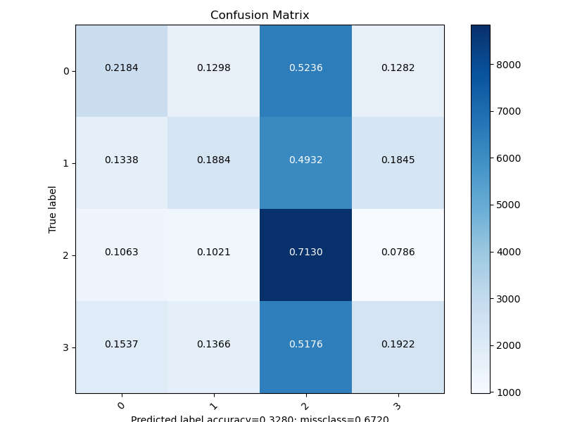
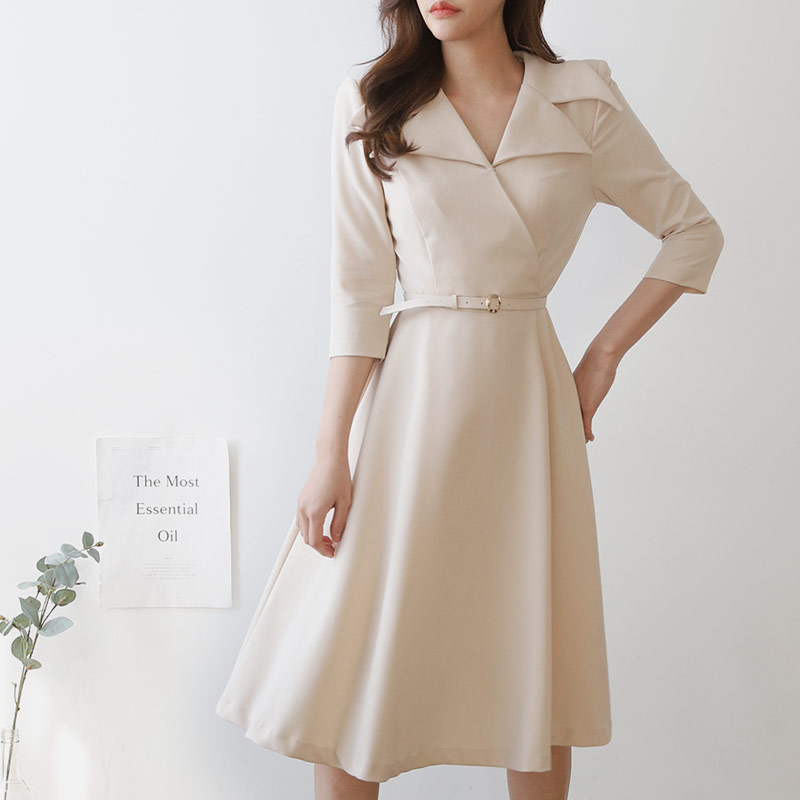
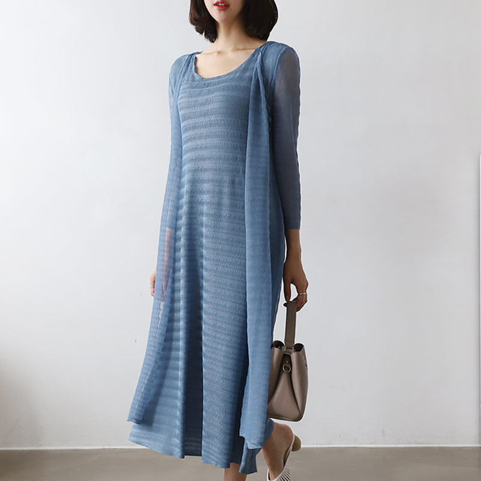
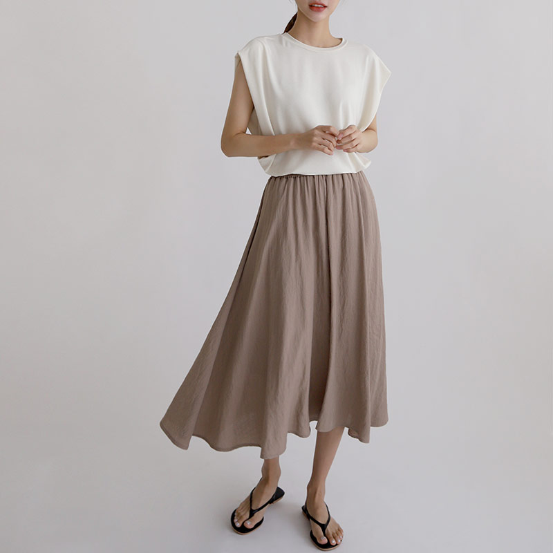

# K-fashion Classification

## 데이터 분석



> Class 0: dresses\\
Class 1: outerwear\\
Class 2: pants\\
Class 3: tops\\
> 

*참고: Labeling이 제대로 이루어지지 않은 데이터 일부는 Dataset에 포함시키지 않았습니다.*

### 문제 상황(1): Imbalanced Class

- 위 데이터 개수 지표를 통해 현재 데이터가 매우 불균형한 것을 확인할 수 있습니다.

### 문제 해결 과정(1)

- Classification에서 데이터가 불균형할 경우 데이터를 분류하기 어려울 수 있습니다. 따라서 데이터를 균형있게 맞추어주기 위해서 가장 적은 데이터인 Class 2(pants)의 숫자만큼 샘플링하였습니다.

```python
# In utils/datasets.py
# _find_files(...)
for c in sorted(cls):
        files = glob(os.path.join(basepath, c, '*'))
        count += [len(files)]
    minimum = min(count)
```

### 문제 상황(2): Difficulty in identification

- 학습 데이터의 구별이 어렵습니다.



Confusion matrix

- 특히 학습을 직접 해보면 특정 클래스의 분류가 어려운 것을 확인할 수 있습니다.
    - 하단의 지표는 어느정도 수렴이 이루어진 상태의 자료이고, Train 데이터와 Validation 각각의 클래스별 Precision, Recall 지표입니다.

```markdown
precision0: 0.6675
precision1: 0.5966
precision2: 0.8154
precision3: 0.5936

recall0: 0.3672
recall1: 0.2226
recall2: 0.7630
recall3: 0.1905

val_precision0: 0.2913
val_precision1: 0.3725
val_precision2: 0.3097
val_precision3: 0.4286

val_recall0: 0.0313
val_recall1: 0.0481
val_recall2: 0.6099
val_recall3: 9.6805e-04
```

- 위 지표로 보아 dresses(0), tops(1), outerwear(3) 클래스의 recall이 낮은 것을 확인할 수 있습니다.
    - precision: 모델이 정답이라고 분류한 것 중 실제 정답의 비율을 나타냅니다.
    - recall: 실제 정답 중에서 모델이 맞춘 정도를 나타냅니다.
    - 아래 사진을 보면 드레스와 아우터를 구별하기가 어려운 것을 확인할 수 있습니다.


*outerwear 이미지*


*dresses 이미지*

- top 클래스는 사람이 보아도 어느 것으로 분류할지 어려움이 있습니다.


*tops 이미지*

- 또한 pants는 매우 잘 분류하는 것을 확인할 수 있습니다. 이는 사진 구도가 하의를 정확하게 잡고 있어주어 특징을 잘 잡는 것으로 예상됩니다.


*pants 이미지*

### 문제 해결 과정(2)

1. 적절하게 분류하기 어려운 데이터를 직접 제거한다.

 이 방법은 당장 학습 지표를 상승시킬 수 있으나 테스트 지표를 하락시키게 됩니다. 테스트 데이터셋에도 분류하기 어려운 문제들이 함께 있어 효과적이지 못한 해결 방법 입니다.

2. 객체의 위치를 탐지하여 해당 객체만 분류한다.

 객체 탐지를 통해 구별하더라도 사진이 당장 의미하는 바를 구별하기가 매우 힘든 상황입니다. 또한, 객체를 탐지하여 해당 픽셀들만 분류하더라도 불필요한 부분만 제거될 뿐이지 성능 향상에는 도움이 되지 않는다고 판단됩니다.